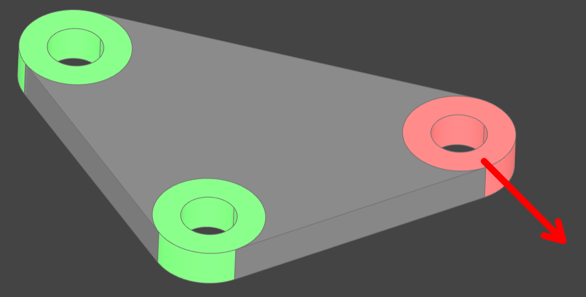
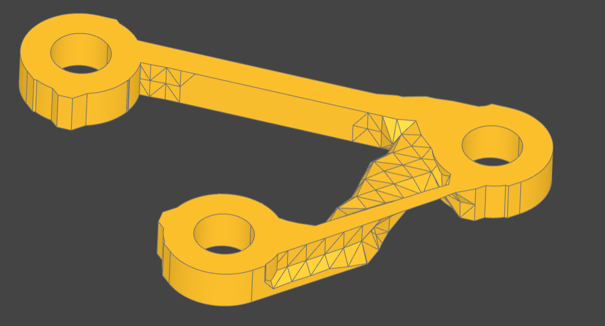

# DL4OP4OCP - Deep Learning for Topology Optimization for OpenCascade Python

This is a tool that helps perform [topology optimization](https://en.wikipedia.org/wiki/Topology_optimization) on
your [OCP](https://github.com/CadQuery/OCP)-based CAD
models ([CadQuery](https://github.com/CadQuery/cadquery)/[Build123d](https://github.com/gumyr/build123d)/...) using
the [dl4to](https://github.com/dl4to/dl4to) library.

## Example

### Installation

This guide assumes you already have a working recent python 3 environment with pip installed.

- Download the contents of the `example` folder and enter it.
- Create the virtual python environment and install the dependencies:

```bash
python -m venv venv
. venv/bin/activate  # Execute this line every time you change the terminal
pip install -r requirements.txt
```

- Start the ocp_vscode to view the intermediate results (optional).
- Run the script: `python example.py`.
- The `export` folder will contain the solution.

### Usage

The `example.py` script contains all the code that defines the optimization problem and runs the optimization.

The script defines the problem by creating the following CAD solids:



1. The green solids are the boundary conditions. Think of them as the fixed parts of the structure.
2. The red solid has a force applied to it in the direction of the red arrow.
3. The gray solid is the design space. The optimization algorithm will remove some material from this solid to optimize
   the structure according to your criteria (material properties, force strength, target volume, etc).

Once these solids are defined, they are passed to the `ProblemSetup` class, which configures the `dl4to` problem.
You have full control over the optimization problem by interacting with `dl4to` directly after the conversion, but some
utilities and defaults are also available to make starting easier. The solution for this example is:

